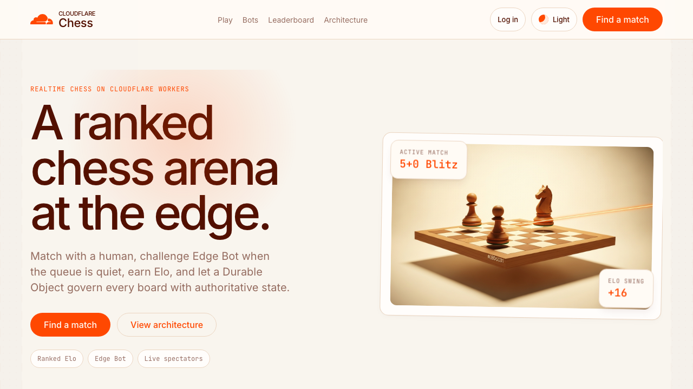
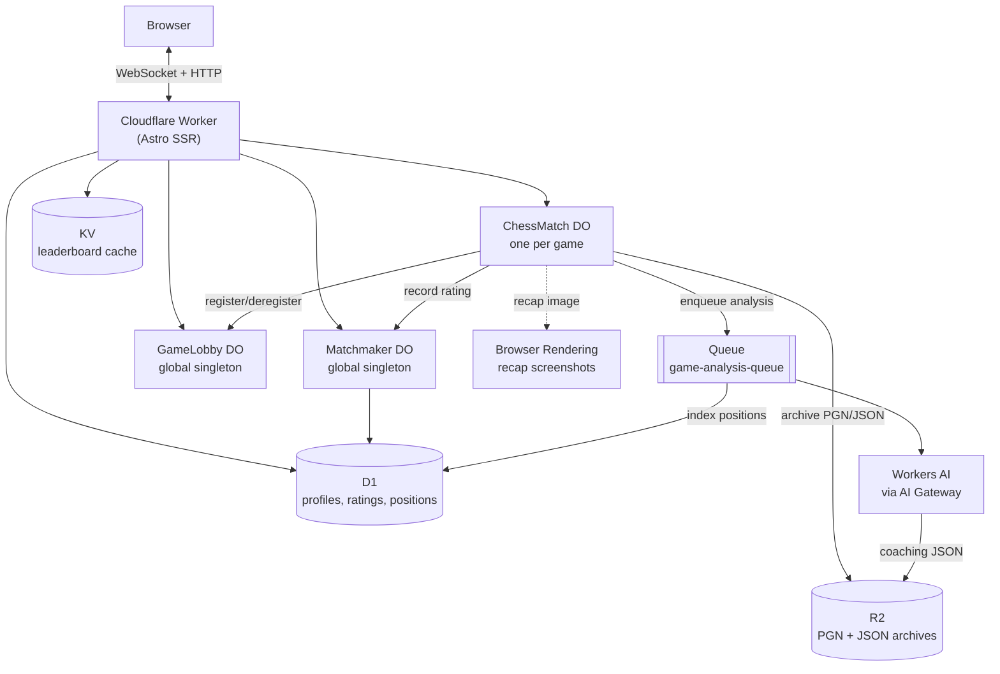

# Cloudflare Chess

[](https://deploy.workers.cloudflare.com/?url=https://github.com/Gryczka/cloudflare-chess)
[](LICENSE)

> An edge-native, real-time multiplayer chess platform built entirely on Cloudflare Workers — no origin server, ever. Durable Objects hold authoritative game state, D1 tracks Elo ratings, R2 archives finished games, Queues drive async AI coaching, and Browser Rendering generates shareable recap images.

**[Live demo](https://chess.cloudflare.app/)**



> **Project status:** this is a reference/sample project maintained on a best-effort basis, not a supported product. Issues and PRs are welcome, but please don't expect guaranteed response times.

## Table of Contents

- [Architecture](#architecture)
- [Features](#features)
- [Tech Stack](#tech-stack)
- [Prerequisites](#prerequisites)
- [Getting Started](#getting-started)
- [Configuration](#configuration)
- [Deploying to Cloudflare](#deploying-to-cloudflare)
- [Project Structure](#project-structure)
- [Security Notes](#security-notes)
- [Contributing](#contributing)
- [License](#license)
- [Acknowledgments](#acknowledgments)

## Architecture



Every request is handled at the Cloudflare edge — there is no traditional backend server. The `ChessMatch` Durable Object is the single source of truth for one game (board, clocks, chat, presence), coordinated over WebSocket Hibernation so connections can idle without keeping the whole object in memory. Two global-singleton Durable Objects handle cross-game concerns: `Matchmaker` pairs players and owns hot-path coordination state, while `GameLobby` tracks currently-active games for the spectator "TV" view. Player profiles, Elo history, and the opening-explorer position index live in D1 since they need to be queried across all players rather than partitioned per game.

## Features

- **Real-time multiplayer** — rated games and five bot personalities, synced over WebSockets with Hibernation
- **Anonymous accounts** — mint a handle (`adjective-noun-NNNN`) instantly; recover via a one-time secret key (`cfk_…`), never stored in plaintext
- **Elo ratings** — k-factor Elo with per-time-control ratings (bullet/blitz/rapid) and a public leaderboard (min. 10 rated games), cached in KV
- **Time controls** — 1 / 3 / 5 / 10 minutes, with FIDE-style draw-offer and premove rules
- **Live evaluation bar** — a shallow negamax search runs inside the game's Durable Object for a client-side eval indicator
- **AI post-game coaching** — Workers AI (via AI Gateway) analyzes finished rated games and stores a structured summary, key moment, and improvement tip
- **PGN export & replay** — download or scrub through any archived game; archives are written immutably to R2
- **Opening explorer** — every indexed game's positions feed a D1-backed explorer showing top continuations and win rates from any position
- **Spectator TV** — `/games` shows all currently active rated matches with live spectator counts, backed by the `GameLobby` singleton Durable Object
- **Live platform stats** — the landing page hero ribbon polls active game count, spectators, and registered players
- **Shareable recap images** — Browser Rendering screenshots the final board for `og:image` social previews
- **Signed HttpOnly cookies** — sessions are HMAC-SHA256 signed; the raw handle is never the credential
- **Rate limiting + Turnstile** — configurable via the Cloudflare dashboard; no-op locally so dev/CI stay green without setup
- **Mobile-friendly** layout throughout

## Tech Stack

| Layer | Technology |
|-------|-----------|
| Compute | [Cloudflare Workers](https://workers.cloudflare.com/) |
| Stateful coordination | [Durable Objects](https://developers.cloudflare.com/durable-objects/) (SQLite storage, WebSocket Hibernation, Alarms) |
| Relational data | [D1](https://developers.cloudflare.com/d1/) — profiles, ratings, opening-explorer positions |
| Object storage | [R2](https://developers.cloudflare.com/r2/) — immutable game archives (PGN + JSON), AI coaching output |
| Cache | [Workers KV](https://developers.cloudflare.com/kv/) — leaderboard cache |
| Async processing | [Queues](https://developers.cloudflare.com/queues/) — post-game AI analysis pipeline |
| AI | [Workers AI](https://developers.cloudflare.com/workers-ai/) via [AI Gateway](https://developers.cloudflare.com/ai-gateway/) |
| Rendering | [Browser Rendering](https://developers.cloudflare.com/browser-rendering/) — recap screenshots |
| Framework | [Astro](https://astro.build/) (SSR via `@astrojs/cloudflare`) |
| Chess logic | [chess.js](https://github.com/jhlywa/chess.js) (rules/legality) + [cm-chessboard](https://github.com/shaack/cm-chessboard) (board UI) |
| Language | TypeScript |
| Testing | [Vitest](https://vitest.dev/) + [`@cloudflare/vitest-pool-workers`](https://developers.cloudflare.com/workers/testing/vitest-integration/) for real Durable Object/workerd integration tests |

## Prerequisites

- Node.js **22+**
- A [Cloudflare account](https://dash.cloudflare.com/sign-up) (free tier works for local dev; Browser Rendering requires a Workers Paid plan in production)
- The [Wrangler CLI](https://developers.cloudflare.com/workers/wrangler/) (installed automatically as a dev dependency)

## Getting Started

### Clone the repository

```bash
git clone https://github.com/Gryczka/cloudflare-chess.git
cd cloudflare-chess
```

### Install dependencies

```bash
npm install
```

### Configure local secrets (optional)

```bash
cp .dev.vars.example .dev.vars
```

If `AUTH_SECRET` is blank or omitted, local development falls back to a known insecure value so session cookies still work. The Deploy to Cloudflare flow requires a real value. Turnstile remains disabled locally unless configured after deployment (see [Configuration](#configuration)).

### Run the dev server

```bash
npm run dev        # wrangler types && astro dev — http://localhost:8788
```

### Run tests and type-check

```bash
npm run check        # astro check + unit tests + workers tests (the full CI gate)
npm run test:unit     # Node/vitest unit tests only
npm run test:workers  # workerd/vitest Durable Object integration tests only
```

## Configuration

All configuration lives in `wrangler.jsonc`. The repo ships with safe placeholder resource values so `npm install && npm run dev` works with zero setup. The Deploy to Cloudflare flow replaces provisioned resource IDs and prompts for required secrets.

| Variable / Binding | Purpose | Required for local dev? |
|---|---|---|
| `AUTH_SECRET` | HMAC key signing session cookies (QR-1) | No — blank/omitted falls back locally; required by Deploy to Cloudflare and production deploys |
| `TURNSTILE_SECRET_KEY` | Cloudflare Turnstile secret, guards account creation | No — empty disables the check (no-op) |
| `RATE_LIMIT_ENROLL` / `RATE_LIMIT_LOGIN` | Rate Limiting bindings (QR-9) | No — Wrangler provides local simulations; namespace IDs are application-defined integers |
| `KV` namespace | Leaderboard cache | No — placeholder id works with `remoteBindings: false` |
| `DB` (D1) | Profiles, ratings, opening-explorer positions | No — migrations auto-apply in dev/tests |
| `R2_ARCHIVE` bucket | Immutable game archives | No — placeholder works locally |
| `GAME_ANALYSIS_QUEUE` | Post-game AI analysis queue | No |
| `AI` | Workers AI binding, routed through an AI Gateway | No, but real analysis requires a real account + gateway |
| `BROWSER` | Browser Run binding for recap screenshots | No — remote use is subject to your account's Browser Run limits |

See the [Deploying to Cloudflare](#deploying-to-cloudflare) section for the commands to provision each real resource.

## Deploying to Cloudflare

The button at the top of this README provisions the supported bindings, prompts for `AUTH_SECRET`, applies D1 migrations, registers the Queue consumer, and deploys the Worker. AI Gateway and Turnstile remain optional post-deploy configuration.

For a manual deployment, follow the steps below.

**1. Create the required resources** (one-time, per Cloudflare account):

```bash
npx wrangler kv namespace create CF_CHESS_KV
npx wrangler d1 create cf-chess-profiles
npx wrangler r2 bucket create cf-chess-archive
npx wrangler queues create game-analysis-queue
```

Copy the returned KV namespace id and D1 database id into `wrangler.jsonc`, replacing the placeholder values.

**2. Apply D1 migrations:**

```bash
npx wrangler d1 migrations apply DB --remote
```

**3. Set the session-signing secret** (required):

```bash
npx wrangler secret put AUTH_SECRET
```

**4. Optional — Turnstile** (protects account creation against bot farming):

1. Create a Turnstile widget in the [Cloudflare dashboard](https://dash.cloudflare.com/?to=/:account/turnstile).
2. Set the secret key: `npx wrangler secret put TURNSTILE_SECRET_KEY`
3. Add the corresponding site key to the enroll form.

**5. Optional — Rate Limiting:**

The checked-in namespace IDs are application-defined positive integers and work as-is. Change them only if they collide with another Worker's Rate Limiting bindings in your account and you do not want those Workers to share counters.

> Wrangler uses local Rate Limiting simulations during development, so local calls do not affect deployed counters.

**6. Configure an AI Gateway** (for post-game coaching): create a gateway named `cf-chess-gateway` in the dashboard, or change the `gateway.id` in `src/worker.ts` to match your own.

**7. Build, apply migrations, and deploy:**

```bash
npm run deploy
```

## Project Structure

```
cloudflare-chess/
├── src/
│   ├── worker.ts                  # Entry point: exports DOs + Queue consumer + Astro SSR handler
│   ├── lib/
│   │   ├── durable-objects/       # ChessMatch, Matchmaker, GameLobby
│   │   ├── chess/                 # Rules engine, bot search/opening book, position keys
│   │   ├── d1/                    # D1 data-access layer (profiles, opening explorer)
│   │   ├── identity.ts            # Signed-cookie session helpers (QR-1)
│   │   ├── crypto.ts              # HMAC + SHA-256 Web Crypto utilities
│   │   ├── rate-limit.ts          # Rate Limiting wrapper (no-op when binding absent)
│   │   ├── turnstile.ts           # Turnstile server-side verification
│   │   ├── player-id.ts           # Handle + recovery-secret generation
│   │   ├── escape.ts              # XSS-safe JSON-in-HTML serialization
│   │   └── messages.ts            # Shared WebSocket protocol + data-model types
│   ├── pages/
│   │   ├── api/                   # REST + WebSocket-upgrade route handlers
│   │   ├── match/[id].astro       # Live game page
│   │   ├── games.astro            # Spectator TV
│   │   ├── explore.astro          # Opening explorer
│   │   └── ...                    # Landing, play, leaderboard, profile, login, etc.
│   ├── scripts/                   # Browser-side TypeScript (match, matchmake, account)
│   └── components/                # Astro UI components
├── migrations/                    # D1 schema migrations
├── tests/
│   ├── unit/                      # Node/vitest (engine, identity, escape, abuse)
│   └── workers/                   # workerd/vitest (Durable Object integration tests)
├── docs/screenshots/              # README assets
├── .github/                       # CI workflow, issue/PR templates
├── wrangler.jsonc                 # Worker + bindings configuration
├── .dev.vars.example              # Local secret template
├── LICENSE
├── CONTRIBUTING.md
└── CODE_OF_CONDUCT.md
```

## Security Notes

- **Session cookies** are `HttpOnly`, `SameSite=Lax`, and HMAC-signed — the raw player handle is never the credential. In production, cookies also carry `Secure` and use the `__Host-` prefix.
- **Recovery key** (`cfk_…`) is shown once at account creation and never stored in plaintext — only its SHA-256 hash is persisted.
- **Rate limiting** protects account creation (5 req/60s) and login (10 req/60s). Bindings are no-ops when unconfigured, keeping local dev green.
- **Turnstile** protects the enroll endpoint against bot account farming; also a no-op without a secret key configured.
- **XSS** — all server-rendered JSON payloads are escaped via `jsonForScript` (closes `</script>` breakout). Usernames are sanitized of HTML-dangerous characters.
- `AUTH_SECRET` defaults to an insecure dev placeholder — a loud `console.warn` fires if it is not overridden in production.

## Contributing

Contributions are welcome. Please read the [Contributing Guide](CONTRIBUTING.md) for development setup and the pull request process. See [CODE_OF_CONDUCT.md](CODE_OF_CONDUCT.md) for community expectations and [SECURITY.md](SECURITY.md) to report a vulnerability.

## License

This project is licensed under the MIT License. See [LICENSE](LICENSE) for details.

## Acknowledgments

- [chess.js](https://github.com/jhlywa/chess.js) for move validation and game-state logic
- [cm-chessboard](https://github.com/shaack/cm-chessboard) for the interactive board UI
- [Astro](https://astro.build/) for edge-native SSR
- The [Cloudflare Workers](https://developers.cloudflare.com/workers/) and [Durable Objects](https://developers.cloudflare.com/durable-objects/) docs and examples
